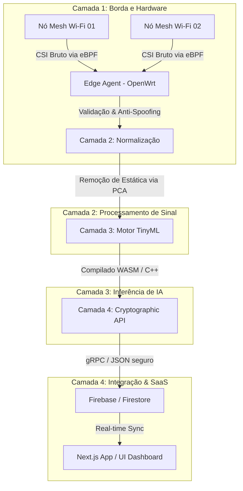

# Arquitetura do Sistema — WGF SenseOS

Este documento descreve a arquitetura técnica da plataforma **WGF SenseOS**, detalhando desde a ingestão de sinais de radiofrequência até a visualização no dashboard e a segurança de dados.

## Visão Geral da Arquitetura (Universal Wi-Fi Sensing Core - UWSC)

O WGF SenseOS foi desenhado sob o conceito de desacoplamento completo entre o hardware transcetor e o motor matemático de processamento. A arquitetura divide-se em 4 camadas modulares independentes:



---

### Camada 1: Ingestão de Borda e Segurança Física (Hardware & eBPF)
*   **Captura de Pacotes Nativa (eBPF):** Para contornar bloqueios dos sistemas operacionais (Android/iOS/Windows) ao CSI (Channel State Information), o agente local de borda utiliza filtros eBPF (Extended Berkeley Packet Filter) diretamente na pilha de rede do Kernel Linux (OpenWrt/Nexmon).
*   **Módulo Anti-Spoofing (Impressão Digital de RF):** Analisa imperfeições microscópicas das ondas eletromagnéticas (desbalanceamento I/Q e phase noise do oscilador de rádio). Se um invasor tentar injetar sinais simulados usando um SDR (Software Defined Radio), o sistema detecta a anomalia física e descarta os pacotes.

### Camada 2: Matriz de Abstração Universal
*   **Normalização Dinâmica de Subportadoras:** Diferentes padrões Wi-Fi expõem diferentes números de subportadoras (52 no Wi-Fi 5, 242 no Wi-Fi 6, 484 no Wi-Fi 7). Esta camada matemática converte qualquer vetor bruto de CSI recebido em uma matriz tensorial padronizada fixa ($T \times S \times A$ - Tempo $\times$ Subportadoras Normalizadas $\times$ Antenas).
*   **Filtro de Despachamento Espacial (PCA):** Remove flutuações e ruído causados por objetos inanimados (paredes, mobília estática) usando Análise de Componentes Principais (PCA) otimizada em C++, alimentando o motor de IA estritamente com as perturbações dinâmicas ambientais (humanos e animais em movimento).

### Camada 3: Motor de Inferência TinyML Embutido
*   **Micro-Runtime C++20 / WebAssembly:** Os modelos de IA (Deep Learning) são compilados em código de máquina puro altamente otimizado ou WASM, protegendo o código proprietário contra engenharia reversa.
*   **Arquitetura Híbrida (CNN + SNN):**
    *   **CNN (Convolutional Neural Networks):** Extrai características espaciais instantâneas (massa corporal, amplitude de perturbação).
    *   **SNN (Spiking Neural Networks):** Processa eventos de variação apenas quando há movimento no ambiente, reduzindo o uso de CPU para quase zero em ambientes estáticos.
    *   **Quantização INT8:** Reduz o tamanho do modelo de Gigabytes para poucos Megabytes, permitindo a execução na memória RAM limitada de roteadores comerciais domésticos.

### Camada 4: API Criptográfica de Conhecimento Zero (ZKP)
*   **Anonimização Efêmera:** Converte a assinatura comportamental da caminhada (gait signature) e o padrão respiratório diretamente em um hash matemático irreversível (ZKP Hash) antes de qualquer transmissão.
*   **gRPC e Protocol Buffers:** Entrega segura de telemetria refinada (coordenadas X/Y/Z, contagem de pessoas, alertas) para a nuvem através de gRPC criptografado.

---

## Integração Next.js & Firebase

A plataforma atual utiliza uma arquitetura baseada em Next.js (App Router) e Firebase (Authentication + Firestore).

### Autenticação (Firebase Auth)
O sistema suporta tanto o **Modo Simulado** (sem backend real, utilizando sessões locais no navegador) como o **Modo Firebase Real** dependendo da variável `NEXT_PUBLIC_SIMULATION_ONLY` no arquivo `.env.local`.
*   As rotas do dashboard estão protegidas por guards de autenticação que redirecionam utilizadores não autenticados para `/login`.

### Base de Dados (Cloud Firestore)
O schema do banco de dados está modelado de forma a garantir isolamento de multi-inquilinos (multi-tenant) e escalabilidade física.

#### Estrutura de Coleções:
*   `/users/{userId}`: Perfil e configurações do utilizador (inclui `organizationId` e `role`).
*   `/organizations/{orgId}`: Detalhes da organização (plano de subscrição, limites de sensores, modo residencial ou corporativo).
*   `/sites/{siteId}`: Locais ou edifícios físicos cadastrados sob uma organização.
*   `/zones/{zoneId}`: Divisões mapeadas no local (quartos, corredores, salas).
*   `/sensors/{sensorId}`: Sensores Wi-Fi (reais ou simulados) associados aos locais.
*   `/alerts/{alertId}`: Alertas de segurança ou saúde gerados no local.

---

## Regras de Segurança (Firestore Security Rules)

Implementamos um mecanismo avançado de controle de acesso nas regras do Firestore para proteger os dados sensíveis:

1.  **Isolamento de Tenant:** Um utilizador apenas pode ler/escrever dados que pertençam à sua própria `organizationId`.
2.  **Fallback de Custom Claims:** Para mitigar a dependência de processos backend de atualização de tokens, as regras do Firestore tentam obter o `organizationId` e `role` do utilizador diretamente do seu documento em `/users/{userId}` quando estas informações não estão presentes no token JWT do Firebase Auth.

```javascript
function getUserOrg() {
  return request.auth.token.organizationId != null
    ? request.auth.token.organizationId
    : get(/databases/$(database)/documents/users/$(request.auth.uid)).data.organizationId;
}
```
