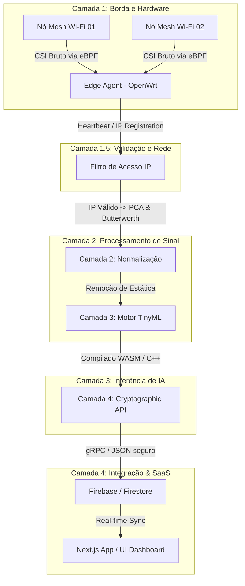

# Arquitetura do Sistema — WGF SenseOS

Este documento descreve a arquitetura técnica da plataforma **WGF SenseOS**, detalhando desde a ingestão de sinais de radiofrequência até a visualização no dashboard e a segurança de dados.

## Visão Geral da Arquitetura (Universal Wi-Fi Sensing Core - UWSC)

O WGF SenseOS foi desenhado sob o conceito de desacoplamento completo entre o hardware transcetor e o motor matemático de processamento. A arquitetura divide-se em 5 camadas modulares independentes:


```mermaid
graph TD
    subgraph Camada 1: Borda e Hardware
        AP1[Nó Mesh Wi-Fi 01] -->|CSI Bruto via eBPF| Edge[Edge Agent - OpenWrt]
        AP2[Nó Mesh Wi-Fi 02] -->|CSI Bruto via eBPF| Edge
    end

    subgraph Camada 1.5: Validação e Rede
        Edge -->|Heartbeat / IP Registration| L1_5[Filtro de Acesso IP]
    end

    subgraph Camada 2: Processamento de Sinal
        L1_5 -->|IP Válido -> PCA & Butterworth| L2[Camada 2: Normalização]
        L2 -->|Remoção de Estática| L3[Camada 3: Motor TinyML]
    end

    subgraph Camada 3: Inferência de IA
        L3 -->|Compilado WASM / C++| L4[Camada 4: Cryptographic API]
    end

    subgraph Camada 4: Integração & SaaS
        L4 -->|gRPC / JSON seguro| FB[Firebase / Firestore]
        FB -->|Real-time Sync| Web[Next.js App / UI Dashboard]
    end
```

---

### Camada 1: Ingestão de Borda e Segurança Física (Hardware & eBPF)
*   **Captura de Pacotes Nativa (eBPF):** Para contornar bloqueios dos sistemas operacionais (Android/iOS/Windows) ao CSI (Channel State Information), o agente local de borda utiliza filtros eBPF (Extended Berkeley Packet Filter) diretamente na pilha de rede do Kernel Linux (OpenWrt/Nexmon).
*   **Módulo Anti-Spoofing (Impressão Digital de RF):** Analisa imperfeições microscópicas das ondas eletromagnéticas (desbalanceamento I/Q e phase noise do oscilador de rádio). Se um invasor tentar injetar sinais simulados usando um SDR (Software Defined Radio), o sistema detecta a anomalia física e descarta os pacotes.

### Camada 1.5: Verificação e Topologia IP (Segurança de Rede Real)
*   **Controle de Acesso por IP:** Extrai o IP de origem do cliente no momento em que um nó envia sinais de batimento cardíaco (*heartbeat*). Esse IP é guardado como referência de rede no Firestore.
*   **Validação de Ingestão:** Toda telemetria subsequente enviada pelo nó na rota de ingestão deve corresponder rigorosamente ao IP registado. Caso haja divergência ou tentativas de injeção externa direta sem batimento prévio autorizado, os pacotes são descartados de forma síncrona (retornando HTTP 403 Forbidden) e um alerta de spoofing físico de rede é registrado.

### Camada 2: Matriz de Abstração Universal + RF SLAM
*   **Normalização Dinâmica de Subportadoras:** Diferentes padrões Wi-Fi expõem diferentes números de subportadoras (52 no Wi-Fi 5, 242 no Wi-Fi 6, 484 no Wi-Fi 7). Esta camada matemática converte qualquer vetor bruto de CSI recebido em uma matriz tensorial padronizada fixa ($T \times S \times A$ - Tempo $\times$ Subportadoras Normalizadas $\times$ Antenas).
*   **Filtro de Despachamento Espacial (PCA):** Remove flutuações e ruído causados por objetos inanimados (paredes, mobília estática) usando Análise de Componentes Principais (PCA) otimizada em C++, alimentando o motor de IA estritamente com as perturbações dinâmicas ambientais (humanos e animais em movimento).
*   **RF SLAM (Mapeamento Espacial):** Sistema completo de mapeamento indoor baseado em WiFi:
    *   **AoA Estimator:** MUSIC-inspired beamforming para estimar ângulos de chegada
    *   **ToF Estimator:** Phase slope analysis para estimar tempo de voo
    *   **Multipath Analyzer:** Deteção de paredes e obstáculos via reflexões
    *   **Floor Plan Generator:** Geração de floor plans geométricos exportáveis

### Camada 3: Motor de Inferência Real
*   **Modelos de IA Reais (não simulados):**
    *   **Occupancy CNN:** Estima contagem de pessoas via análise de energia espectral dos subportadores CSI.
    *   **Fall Classifier:** Classificador multi-estágio: detecção de impacto → análise pós-impacto → correlação temporal.
    *   **AoA Localization:** MUSIC-inspired beamforming + estimativa de distância por path loss.
    *   **X-Fi Foundation Model:** Bridge Python para gait identification (requer pesos XRF55).
*   **Model Manager:** Gerenciamento de lifecycle dos modelos com health check, latência e error tracking.
*   **Quantização INT8:** Reduz o tamanho do modelo de Gigabytes para poucos Megabytes, permitindo a execução na memória RAM limitada de roteadores comerciais domésticos.

### Camada 4: API Criptográfica de Conhecimento Zero (ZKP)
*   **ZKP Real (snarkjs Groth16):** Circuitos circom compilados para provas de conhecimento zero reais.
*   **HMAC-SHA256 Fallback:** Quando circuitos não compilados, usa assinatura criptográfica determinística.
*   **CSI Frame Redaction:** Destruição de dados brutos de amplitude/fase após processamento.
*   **GDPR Compliance:** Data subject requests (erasure, portability, rectification).
*   **gRPC e Protocol Buffers:** Entrega segura de telemetria refinada (coordenadas X/Y/Z, contagem de pessoas, alertas) para a nuvem através de gRPC criptografado.

### Camada 5: Analytics RAG e Dashboard 3D
*   **Analytics Conversacional:** Pipeline RAG (Retrieval-Augmented Generation) que permite perguntas em linguagem natural sobre dados de segurança e ocupação.
    *   **Retriever:** Busca contexto relevante no Firestore (alerts, detections, sites)
    *   **Prompt Builder:** Monta prompts com contexto recuperado
    *   **Response Generator:** Streaming LLM (OpenAI) + fallback local
*   **Dashboard 3D:** Renderização de floor plans em 3D com canvas
    *   Rotação/zoom interativo
    *   Toggle 2D/3D
    *   Paredes, sensores, grid 3D

---

## Integração Next.js & Firebase

A plataforma atual utiliza uma arquitetura baseada em Next.js 16 (App Router, Turbopack) e Firebase (Authentication + Firestore + App Hosting).

### Build System (Turbopack)
O projeto utiliza Turbopack (build system nativo do Next.js 16) para compilação rápida. Os pacotes `@uwsc/core`, `@uwsc/edge-protocol` e `@uwsc/privacy-core` são resolvidos como dependências `file:` locais via `package.json`.

### Deploy (Firebase App Hosting)
- Deploy automático via push para o GitHub repo `willan23/wgf-senseos`
- Backend App Hosting em `us-central1`
- URL: `https://wgf-senseos--wgf-senseos.us-central1.hosted.app`
- Cloud Functions geradas automaticamente para rotas dinâmicas (`/api/*`)

### Autenticação (Firebase Auth)
O sistema suporta tanto o **Modo Simulado** (sem backend real, utilizando sessões locais no navegador) como o **Modo Firebase Real** dependendo da variável `NEXT_PUBLIC_SIMULATION_ONLY` no arquivo `.env.local`.
*   As rotas do dashboard estão protegidas por guards de autenticação que redirecionam utilizadores não autenticados para `/login`.

### Base de Dados (Cloud Firestore)
O schema do banco de dados está modelado de forma a garantir isolamento de multi-inquilinos (multi-tenant) e escalabilidade física.

#### Estrutura de Coleções:
*   `/users/{userId}`: Perfil e configurações do utilizador (inclui `organizationId` e `role`).
*   `/organizations/{orgId}`: Detalhes da organização (plano de subscrição, limites de sensores, modo residencial ou corporativo).
*   `/organizations/{orgId}/sites/{siteId}`: Locais ou edifícios físicos cadastrados.
*   `/organizations/{orgId}/zones/{zoneId}`: Divisões mapeadas no local (quartos, corredores, salas).
*   `/organizations/{orgId}/sensors/{sensorId}`: Sensores Wi-Fi reais associados aos locais.
*   `/organizations/{orgId}/alerts/{alertId}`: Alertas de segurança ou saúde gerados no local.
*   `/organizations/{orgId}/detections/{detectionId}`: Deteções de movimento/presença registadas.
*   `/organizations/{orgId}/audit/{auditId}`: Logs de auditoria de acessos.

---

## Regras de Segurança (Firestore Security Rules)

Implementamos um mecanismo avançado de controle de acesso nas regras do Firestore para proteger os dados sensíveis:

1.  **Isolamento de Tenant:** Um utilizador apenas pode ler/escrever dados que pertençam à sua própria `organizationId`.
2.  **Fallback de Custom Claims:** Para mitigar a dependência de processos backend de atualização de tokens, as regras do Firestore tentam obter o `organizationId` e `role` do utilizador diretamente do seu documento em `/users/{userId}` quando estas informações não estão presentes no token JWT do Firebase Auth.

```javascript
function getUserOrg() {
  return request.auth.token.organizationId != null
    ? request.auth.token.organizationId
    : get(/databases/$(database)/documents/users/$(request.auth.uid)).data.organizationId;
}
```
